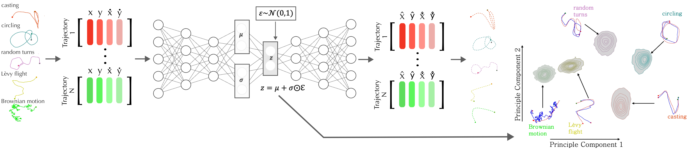

# Trajectory VAE Toolbox

A modular toolbox for visualizing and exploring an autoencoder's latent space

The pipeline for this working example was developed for training/testing different trajectory shapes:



## Features

- **VAE + Triplet Loss Training**: Learn compact latent representations of trajectories
- **Interactive Visualization**: Click on points in 2D latent space to generate trajectories
- To Do: **Hyperparameter Optimization**: Automated optimization with Optuna
- To Do: **Multi-dataset Support**: Works with various trajectory data formats
- **Diagnostic Tools**: Comprehensive plotting and analysis functions

## Installation

```bash
git clone https://github.com/JaleesaHoule/LatentSpaceExplorer.git
cd LatentSpaceExplorer
pip install -r requirements.txt
```

## Run the example

```bash
example.ipynb
```